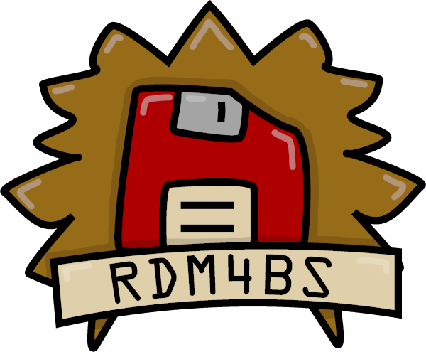

#   Datathon 2024 

### Unleash your inner cartographer!
[Download Flyer](/assets/RDM4BS_Datathon_LoveDataWeek2024.pdf)

_Brought to you by [RDM4Braunschweig](https://rdm4bs.tu-braunschweig.de/) in [Love Data Week 2024](https://www.icpsr.umich.edu/web/about/cms/3799)_

**Date:** &nbsp;&nbsp;&nbsp;&nbsp;&nbsp;&nbsp;&nbsp;<kbd>Tuesday, Feb.13th, 2024</kbd>   
**Time:** &nbsp;&nbsp;&nbsp;&nbsp;&nbsp;&nbsp;&nbsp;<kbd>9:15 - 17:30</kbd>   
**Location:** <a href="https://www.tu-braunschweig.de/khn/anfahrt"><kbd>TU-Braunschweig, Pockelsstraße 4, Lehrstudio (PK 4.111)</kbd></a>

## Schedule

| Time | Activity |
| ---- | -------- |
**09:15 - 09:35** | Introduction 
**09:35 - 09:50** | Basic **GIS intro**   Instructor: Michael
**09:50 - 10:10** | Introduction to geodata processing with **QGIS**  Instructor: Vineeta
**10:10 - 10:30** | Introduction to geodata processing with **R**  Instructor: Harald
**10:30 - 10:40** | **Break**
**10:40 - 11:00** | Introduction to geodata processing with **Python**  Instructor: Michael
**11:00 - 11:30** | Short introduction of more available datasets & **brainstorming ideas**
**11:30 - 12:15** | **Lunch time: Pizza** & ideas & discussion
**12:15 - 12:45** | **Group formation** & planning of tasks
**12:45 - 16:45** | **Datathon!** (4h, self-organized breaks)
**16:45 - 17:15** | Presentation of **results**
**17:15 - 17:20** | Jury discusses
**17:20 - 17:30** | **Award ceremony** & Goodbye

## Material

- [☝️🤓 Introduction to Geographic Information Systems (GIS)](/intro_gis.md)
- [🚂 🍂 Geostory & ressources for introduction](/intro_geostory.md)
- [🌐 Geodata sources](/geodata_sources.md)

## Ideas

[Idea - Pad](https://cryptpad.digitalcourage.de/code/#/2/code/edit/vRudLflAmhI8vWrHdeDMENWj/)

## Technical Preparations

### Basis

+ [QGIS installation](https://qgis.org/de/site/forusers/download.html)
+ [JupyterLab installation](https://jupyter.org/install)
+ [R-kernel for JupyterLab](https://irkernel.github.io/installation/)

### Python packages and R libraries

**For Python:**  
+ [geopandas](https://geopandas.org/en/stable/getting_started.html)
+ [shapely](https://shapely.readthedocs.io/en/stable/installation.html)
+ [rasterio](https://rasterio.readthedocs.io/en/latest/installation.html)
+ [folium](https://pypi.org/project/folium/)

**For R:**   
+ [sf](https://cran.r-project.org/web/packages/sf/index.html)
+ [stars](https://cran.r-project.org/web/packages/stars/index.html)
+ [terra](https://cran.r-project.org/web/packages/terra/index.html)
+ [ows4r](https://cran.r-project.org/web/packages/ows4R/index.html)
+ [tmap](https://cran.r-project.org/web/packages/tmap/index.html)

### OSGeoLive – Your GIS-Computer on a stick

An alternative to installing several programs and packages, you can download the completely pre-configuered system [OSGeoLive](https://live.osgeo.org/de/index.html) with all GIS-tools already installed, write it to a USB-stick and boot your laptop from that stick.

Yet another option is to [run OSGeoLive in a virtual machine](https://live.osgeo.org/en/quickstart/virtualization_quickstart.html) using [VirtualBox](https://www.virtualbox.org/) on your laptop.

### Share intermediate data, upload results

[DESY Sync & Share](https://syncandshare.desy.de/index.php/s/9PQ2N6BHkdEtZdr)