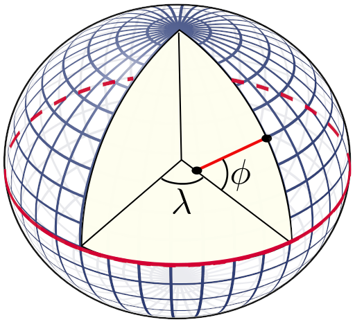
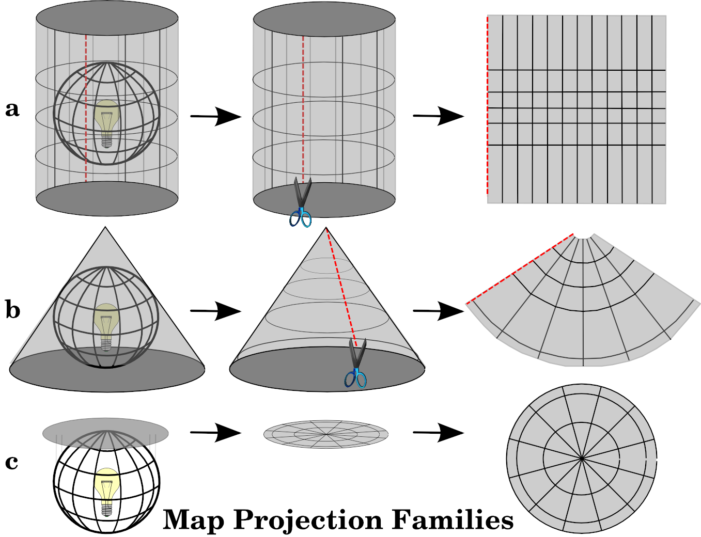
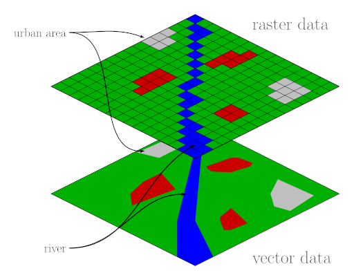

# ☝️🤓 Ultra brief and super-condensed introduction to most important GIS topics for today

You are going to experience effects like "map elements not being displayed" or "being somewhere else than expected" or "not behaving as you wish". Welcome to the fascinating world of GIS!

## Spatial coordinate reference systems and projections

For simplicity, our planet's shape is often approximated by an ellipsoid.

    
     
    <em>Geodetic coordinates on ellipsoid. By Peter Mercator, via <a href="https://commons.wikimedia.org/wiki/File:Latitude_and_longitude_graticule_on_an_ellipsoid.svg">Wikimedia Commons</a>, public domain.</em>

If positions on such an ellipsoid are to be described, geodetic coordinates in *degrees* are used:
- `longitude` *λ* for "east to west"
- `latitude` *ϕ* for "north to south"

The most commonly used [spatial reference system](https://2012books.lardbucket.org/books/geographic-information-system-basics/s06-02-map-scale-coordinate-systems-a.html) in GIS using this convention is:
- [WGS 84](https://epsg.io/4326) (EPSG:4326). It is primarily used for worldwide GNSS applications and measurements. Beware of inconsistencies in the axis order when programming with different libraries: Some expect `long`/`lat` whereas others prefer to have `lat`/`long` for specification of point coordinates 😵!

### Projecting that ball on a flat plane

Are you viewing geodata on your screen? Then it is already projected into 2D 😎! For that, conventional Cartesian coordinates are used, also allowing measurements in real *metres*, yay:
- `x` as "easting"
- `y` as "northing"

    
     
    <em>a) cylindrical projections, b) conical projections, c) planar projections. From <a href="https://docs.qgis.org/3.28/en/docs/gentle_gis_introduction/coordinate_reference_systems.html">QGIS Documentation</a>, GNU Free Documentation License.</em>

    
     
    <em>One example: The cylindrical Mercator projection. From <a href="https://docs.qgis.org/3.28/en/docs/gentle_gis_introduction/coordinate_reference_systems.html">QGIS Documentation</a>, GNU Free Documentation License.</em>

You will encounter different projected coordinate systems when mapping spatial data around Germany:
- [ETRS89 / UTM zone 32N](https://epsg.io/25832) (EPSG:25832) which is recommended to be used for governmental data.
- [WGS 84 / Pseudo-Mercator](https://epsg.io/3857) (EPSG:3857) which is mostly used for background web maps such as Open Street Map (OSM). It serves as good compromise for displaying data of the whole world. But beware of strong distortion effects using this projection: Measured distances at our latitude will likely be "wrong"!

## Vector and raster data models

    
     
    <em>Points, Lines, and Polygons. From <a href="https://2012books.lardbucket.org/books/geographic-information-system-basics/s08-02-vector-data-models.html">Geographic Information System Basics</a>, <a href="https://creativecommons.org/licenses/by-nc-sa/3.0/">CC BY-NC-SA 3.0</a>.</em>

*Features* of the observed world are modelled through vector data.
- Vector features have descriptive *attributes* and a *geometry*.
- In GIS, feature collections are often represented by tables where each row corresponds to one feature with all its attributes as columns.
- In object-oriented programming, a feature *class* would hold all the descriptive attributes. Each object of this class would be one characteristic feature *instance*.
- There are many different data [formats for vector data](https://gdal.org/drivers/vector/index.html) exchange.
- [OGC Web Feature Service](https://en.wikipedia.org/wiki/Web_Feature_Service) (WFS) is a common standard for distribution of vector data over the internet.

### Difference to raster data

    
     
    <em>Difference between vector and raster model when trying to describe "the same things". By Johannes Rössel, via <a href="https://commons.wikimedia.org/wiki/File:Raster_vector_tikz.svg">Wikimedia Commons</a>, <a href="https://creativecommons.org/licenses/by-sa/3.0">CC BY-NC-SA 3.0</a>.</em>

[Rasters](https://2012books.lardbucket.org/books/geographic-information-system-basics/s08-01-raster-data-models.html) are mostly consisting of a uniform grid of square cells with a specific *resolution* and cell *value*.
- Rasters are used for
  - aerial and satellite imagery
  - elevation models
  - spatially continuous phenomenons/observations such as temperature, precipitation etc. 
- Raster cell values can be of any data type such as `Boolean`, `Integer`, `Float`, etc.
- One raster dataset can have multiple *bands* to store multiple values per cell: A regular image has 3 bands for "red", "green" and "blue" pixel colour values.
- There are many different data [formats for raster data](https://gdal.org/drivers/raster/index.html) exchange.
- [OGC Web Map Service](https://en.wikipedia.org/wiki/Web_Map_Service) (WMS) and [Web Coverage Service](https://en.wikipedia.org/wiki/Web_Coverage_Service) (WCS) are common standards for distribution of raster data over the internet.

## Working with vector data 

### Spatial relationships

Spatial analysis consists of queries which return information about [relationships between features](http://postgis.net/workshops/postgis-intro/spatial_relationships.html). Two features can
- be equal
- intersect
- be disjoint
- cross
- overlap
- touch
- be within
- have a distance

### Overlay functions

Performing [spatial overlays](https://en.wikipedia.org/wiki/Vector_overlay) helps identifying relationships between features.

    
     
    <em>Vector Overlay Methods. From <a href="https://2012books.lardbucket.org/books/geographic-information-system-basics/s11-geospatial-analysis-i-vector-o.html">Geographic Information System Basics</a>, <a href="https://creativecommons.org/licenses/by-nc-sa/3.0/">CC BY-NC-SA 3.0</a>.</em>

### Buffering

[Buffers](https://docs.qgis.org/3.28/en/docs/gentle_gis_introduction/vector_spatial_analysis_buffers.html) are useful, powerful and beautiful 💓.

    
     
    <em>Buffer options around red fatures: (a) variable width buffers, (b) multiple ring buffers, (c) doughnut buffer, (d) setback buffer, (e) nondissolved buffer, (f) dissolved buffer. From <a href="https://2012books.lardbucket.org/books/geographic-information-system-basics/s11-geospatial-analysis-i-vector-o.html">Geographic Information System Basics</a>, <a href="https://creativecommons.org/licenses/by-nc-sa/3.0/">CC BY-NC-SA 3.0</a>.</em>

